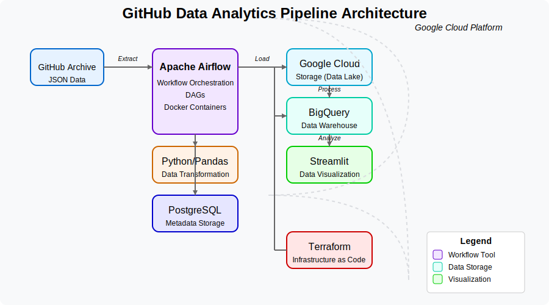

# GitHub 數據分析管線

該專案透過分析 GitHub Watch 事件提供對開源開發趨勢的洞察。它使用 GCP、Airflow 和 BigQuery 構建，允許利益相關者即時探索開發人員參與度和儲存庫受歡迎程度。

## 1. 問題描述

本專案使用 GitHub Archive 資料集分析 GitHub 倉庫的活動情況。目的是擷取、處理與分析「關注（Watch）」事件，以洞察倉庫趨勢、使用者參與度與時間序列的活動模式。

主要分析項目包括：
- 找出最受歡迎的倉庫
- 分析使用者參與行為
- 理解 GitHub 活動的時間趨勢

此管線能提供開源專案人氣與開發者行為的可行性洞察。

## 2. 系統架構



架構採模組化設計，確保系統具備可擴展性與可維護性。整合雲端服務、工作流程調度與資料處理工具。

## 3. 雲端基礎建設

本專案部署於 Google Cloud Platform（GCP），並透過 Terraform 進行基礎建設即程式碼（IaC）的管理。

### 雲端元件：
- **Google Cloud Storage (GCS)**：作為數據湖，用來儲存處理後的 GitHub Archive 資料。
- **Google BigQuery**：作為數據倉儲，支援分析查詢。

### 基礎建設部署：
- 使用 Terraform 配置與管理 GCP 資源。
- 主要資源包括：
  - 儲存處理資料的 GCS bucket
  - 用於分析的 BigQuery dataset

部署指令如下：
```bash
cd terraform
terraform init
terraform plan
terraform apply
```

## 4. 資料擷取 - 批次處理與工作流程調度

使用 Apache Airflow 來調度資料管線，DAG 主要執行以下步驟：

1. 下載每小時的 GitHub Archive JSON 資料。
2. 將原始資料轉換為 Parquet 格式。
3. 上傳處理後資料至 GCS。
4. 在 BigQuery 中建立對應的外部表格供分析使用。

### 主要 Airflow DAG 元件：
- **BashOperator**：下載資料。
- **PythonOperator**：進行資料轉換。
- **GCS Operators**：處理雲端儲存操作。
- **BigQuery Operators**：管理資料倉儲作業。

啟動工作流程指令：
```bash
cd airflow
make up
```
請確認 `env.json` 設定正確後再啟動 Airflow。

## 5. 數據倉儲

BigQuery 是主要的資料倉儲工具：
- 從 GCS 的 Parquet 檔建立外部表格。
- 優化分析 GitHub 資料的查詢效率。

## 6. 資料轉換

資料轉換流程包含：

1. **Python/Pandas**：用於初步 ETL 處理。
   - 過濾所需 GitHub 事件。
   - 轉換為 Parquet 格式以提升效能。

2. **SQL**：在 BigQuery 進行進一步資料轉換與分析。

## 7. 儀表板

本專案提供互動式儀表板進行資料視覺化。

主要儀表板內容包括：
- 倉庫人氣趨勢分析。
- 根據 Watch 數排序的熱門倉庫。
- 使用者參與度與活躍模式。

### Streamlit 儀表板：
本儀表板採用 Streamlit 架設，可於本地端瀏覽 `http://localhost:8501`。或成果[展示1](https://github.com/a920604a/data-engineering-zoomcamp-2025/blob/main/project/GitHub%20WatchEvent%20%E7%86%B1%E9%96%80%20Repo.pdf), [展示2](./ActivityDashboard.pdf)


使用 Docker 啟動 Streamlit：
```bash
cd Visual
docker-compose up
```

請確認 `docker-compose.yml` 設定正確以支援儀表板顯示。

## 8. 可重現性指南

### 前置需求：
- 已啟用計費功能的 Google Cloud 帳戶。
- 安裝 Docker 與 Docker Compose。
- 安裝 Terraform。
- 安裝 Python 3.9 以上版本。

### 安裝與部署步驟：

1. **Clone 專案倉庫**：
   ```bash
   git clone https://github.com/a920604a/data-engineering-zoomcamp-2025.git
   cd project
   ```

2. **設定 GCP 認證**：
   - 建立具備必要權限的 Service Account。
   - 下載 JSON 金鑰檔案。
   - 將其命名為 `service-account.json` 放在專案根目錄。

3. **部署雲端基礎建設**：
   ```bash
   cd terraform
   terraform init
   terraform apply
   ```

4. **啟動 Airflow**：
   ```bash
   cd airflow
   make up
   ```

5. **服務入口**：
   - Airflow UI: http://localhost:8080

6. **環境變數：**
Airflow 需一個 `env.json` 檔案存放敏感變數，請將此檔案放置於 `airflow` 資料夾中。

   範例 `env.json`：
   ```json
   {
   "GCP_PROJECT": "your-gcp-project-id",
   "GCS_BUCKET": "your-gcs-bucket-name",
   "BIGQUERY_DATASET": "your-bigquery-dataset-name"
   }
   ```
7. **觸發管線**：
   - 於 Airflow UI 中觸發 `cloud_gharchive_dag` DAG。

依照以上步驟即可完整重現本專案並開始 GitHub 數據分析。

## 使用技術

- **基礎建設**：Terraform, Google Cloud Platform
- **工作流程調度**：Apache Airflow
- **儲存**：Google Cloud Storage
- **資料倉儲**：Google BigQuery
- **資料處理**：Python, Pandas, PySpark
- **容器化**：Docker, Docker Compose
- **資料視覺化**：Streamlit

## Project Structure
```
  ├── airflow/ # Airflow DAGs and configs 
  ├── terraform/ # IaC scripts for GCP 
  ├── Visual/ # Dashboard code 
  └── README.md # Project overview
```
